<p align="center">
  
</p>

<h1 align="center">Phanna Computer Shop (ហាងកុំព្យូទ័រ ផាន់ណា)</h1>

<p align="center">
  <strong>Modern Computer Hardware E-Commerce & Management System with Bakong KHQR & AI Intelligence</strong><br>
  <em>ប្រព័ន្ធពាណិជ្ជកម្មអេឡិចត្រូនិច និងគ្រប់គ្រងហាងកុំព្យូទ័រទំនើប ជាមួយការទូទាត់ប្រាក់បាគង KHQR និងជំនួយការឆ្លាតវៃ AI</em>
</p>

<p align="center">
  <a href="https://php.net"></a>
  <a href="https://laravel.com"></a>
  <a href="https://filamentphp.com"></a>
  <a href="https://livewire.laravel.com"></a>
  <a href="https://fluxui.dev"></a>
  <a href="https://tailwindcss.com"></a>
  <a href="https://pestphp.com"></a>
  <a href="https://bakong.nbc.org.kh"></a>
</p>

---

## 📌 Overview

**Phanna Computer Shop** is a full-stack e-commerce and retail enterprise resource management system tailored for computer hardware, peripherals, and custom PC builds in Cambodia.

Built on **Laravel 12**, **Livewire 4**, and **Filament v5**, the system provides a bilingual (English & Khmer) storefront with real-time reactive shopping, integrated **National Bank of Cambodia (Bakong) KHQR cashless payments**, province/district shipping logistics, customer self-service tracking, and an administrative panel powered by **Filament Shield RBAC**, business analytics, and an **AI Business Intelligence Assistant**.

---

## 📸 Screenshots

### Administrative Management Panel (Filament v5)

<div align="center">

#### Orders List & Fulfillment Hub
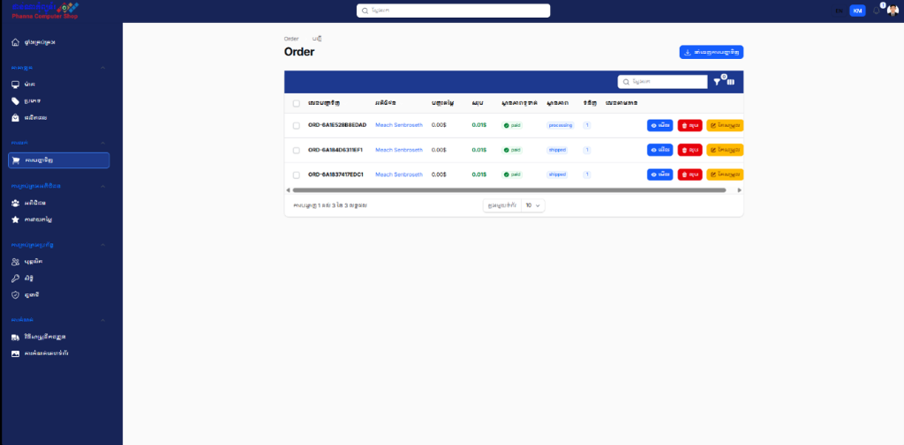
*Filament Admin — Multi-status order queue with customer references, financial totals, payment badges, and quick actions.*

#### Comprehensive Order Breakdown & Line Items
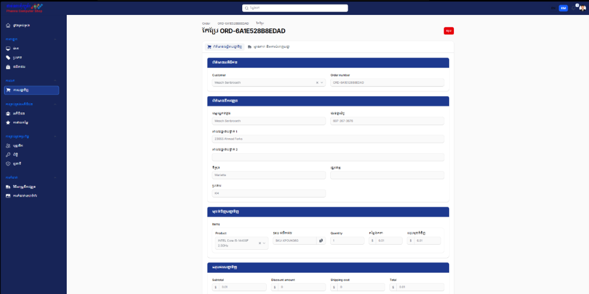
*Filament Admin — Order inspection showing customer identity, shipping address, SKU line items, and financial summary.*

#### Order Status & Logistics Tracking
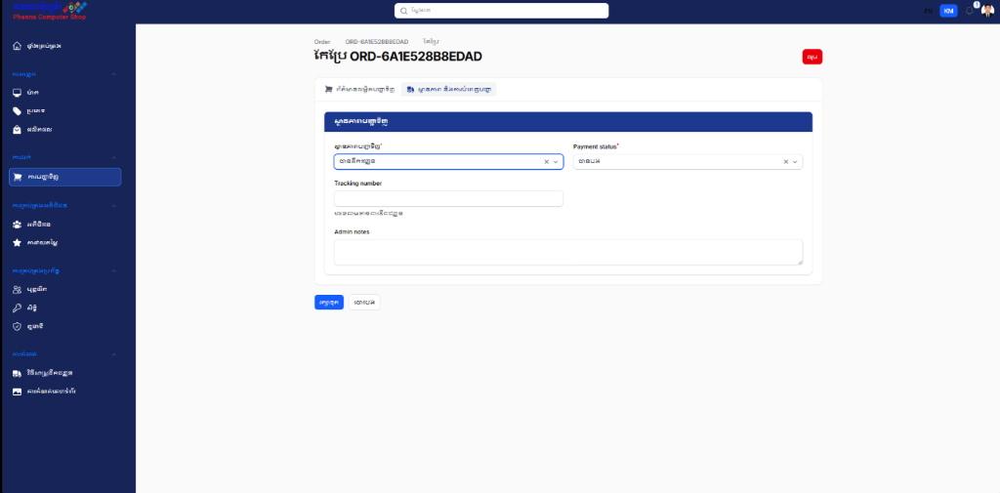
*Filament Admin — Order state transitions (pending, processing, shipped, delivered, completed), carrier tracking numbers, and internal admin notes.*

#### Role-Based Access Control (Filament Shield)
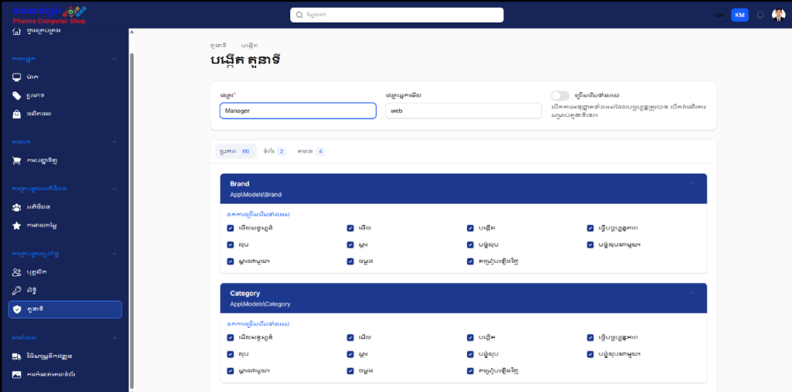
*Filament Admin — Granular permission matrix across models and resources (view, create, update, delete, restore, force-delete).*

#### Staff & Employee Administration
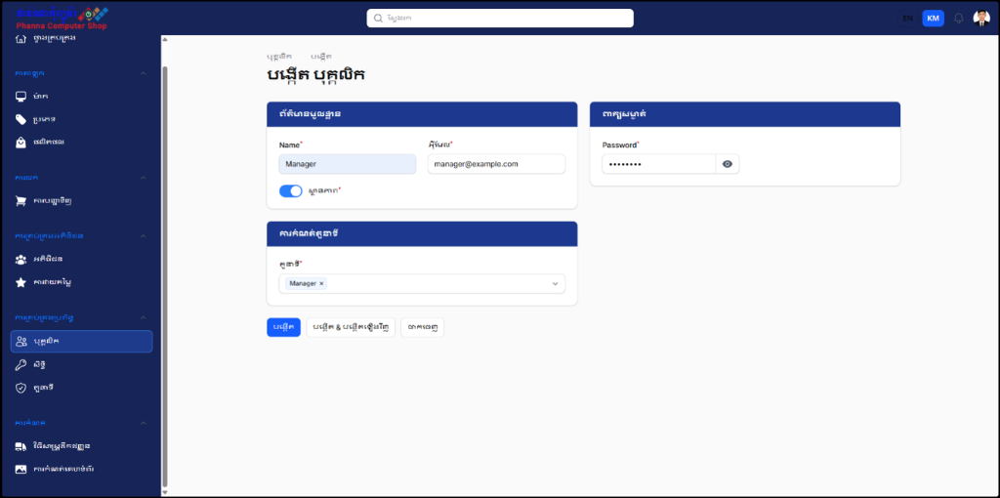
*Filament Admin — Employee onboarding with role assignments, credential controls, and account status toggles.*

</div>

### Storefront & Customer Experience

> *Note: Storefront screenshots below illustrate the planned and implemented Livewire 4 customer journeys. Place captured images in `docs/screenshots/` to display them here.*

| Preview | Description |
| :--- | :--- |
| 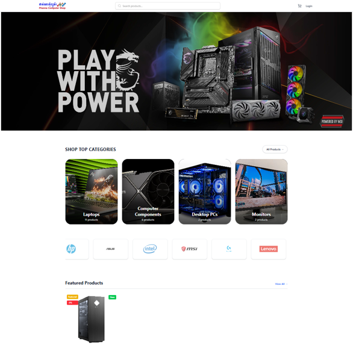 | **Homepage** — Hero promotion banners, product categories, and featured computer hardware. |
| 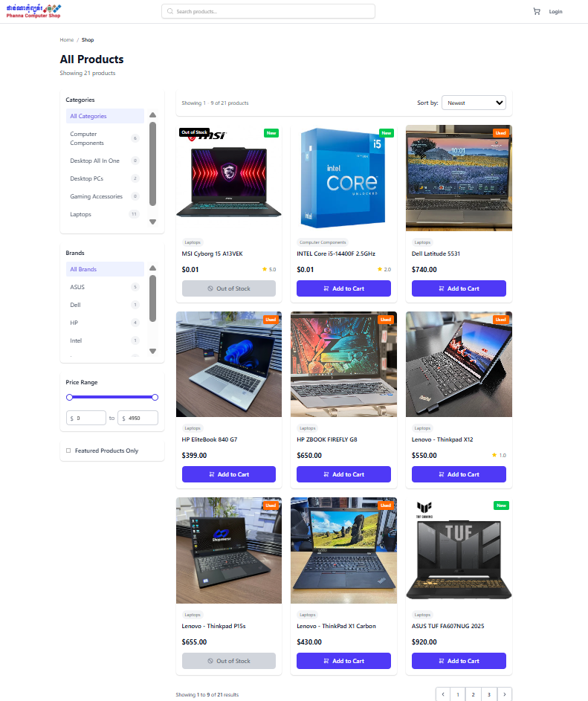 | **Product Catalog** — Multi-attribute filtering (Brand, Category, Price Range, Stock) and full-text search. |
| 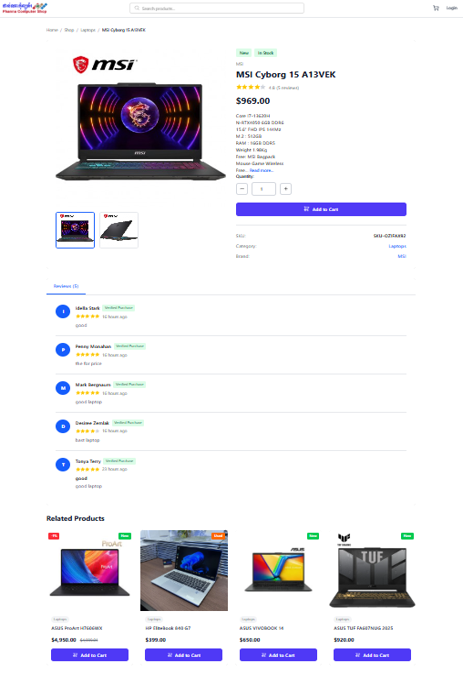 | **Product Specifications** — Gallery view, technical specs, stock availability, and verified buyer reviews. |
| 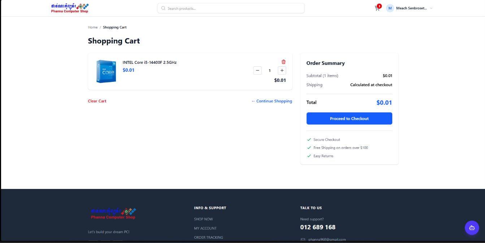 | **Interactive Cart** — Livewire reactive quantity updates, coupon discounts, and instant subtotal recalculations. |
| 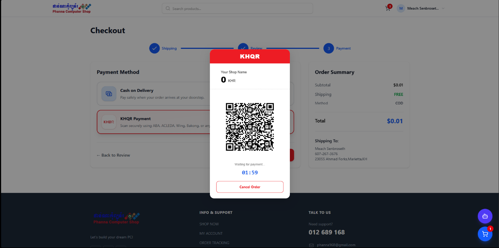 | **Bilingual Checkout** — Cambodian province/district shipping selection, Bakong dynamic KHQR modal, and COD fallback. |
| 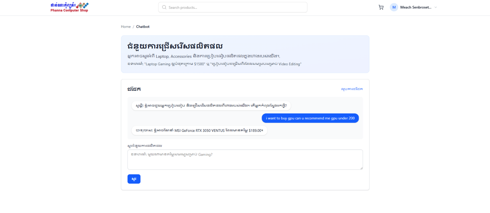 | **AI Computer Advisor** — LLM-powered interactive chatbot providing hardware recommendations and compatibility advice. |

---

## 🚀 Features

### 🛒 Storefront (Customer Experience)
- **Bilingual Interface (EN / KM)**: Instant one-click locale switching between English and Khmer across the entire storefront, with localized navigation, currency, and product metadata.
- **Hardware Catalog & Faceted Search**:
  - Structured categorization (Laptops, Desktop PCs, Components, Monitors, Gaming Accessories).
  - Brand filtering (Dell, ASUS, MSI, HP, Intel, Logitech, etc.).
  - Search engine indexing powered by **Laravel Scout**.
- **Interactive Shopping Cart**: Reactive, zero-page-reload cart state managed by **Livewire 4** and styled with **Flux UI Free** and **Tailwind CSS v4**.
- **Localized Cambodian Checkout**:
  - **Bakong KHQR Payments**: Dynamic EMVCo-compliant QR generation (`fidele007/bakong-khqr-php` & `bacon/bacon-qr-code`) with real-time MD5 transaction verification against the Bakong Open API.
  - **Cash on Delivery (COD)**: Payment on delivery option.
  - **Provincial Shipping Integration**: Shipping calculations based on Cambodia's 25 provinces and municipalities.
- **Customer Portal & Security**:
  - Authentication via **Laravel Fortify** (Registration, Login, Password Reset, Email Verification).
  - Social authentication via **Google OAuth** and **Facebook OAuth** (**Laravel Socialite**).
  - Optional **Two-Factor Authentication (2FA)** with recovery codes.
  - Order history tracking with historical timeline audit (`OrderStatusHistory`).
  - Self-service **Order Delivery Confirmation** (`/my-account/orders/{order}/confirm-delivery`).
- **Verified Buyer Reviews**: Star ratings and customer testimonials restricted to verified purchasers.
- **AI Computer Assistant**: Dedicated `/chatbot` powered by `laravel/ai` (OpenAI / Google Gemini) to guide customers on hardware specs and compatibility.

### ⚙️ Administrative Management Panel (Filament v5)
- **Custom Branded Theme**: Deep-navy enterprise layout matching the Phanna Computer brand, complete with bilingual (Khmer / English) panel toggle.
- **Full Order Lifecycle Management**:
  - State machine workflow: `pending` ➔ `processing` ➔ `shipped` ➔ `delivered` ➔ `completed` (or `cancelled`).
  - Dedicated financial auditing (Subtotal, Discount, Shipping Cost, Total).
  - Automated inventory reservation and restocking logic via `OrderStockService`.
  - PDF Invoice generation via **DomPDF** (`laravel-dompdf`).
- **Product & Inventory Control**:
  - Detailed product catalog with SKU, barcode, cost price, retail price, comparison pricing, and stock alerts.
  - Multi-image gallery upload with primary image designations.
  - Stock threshold monitoring (`LowStockWidget`).
- **Suppliers & Restock Orders**: Vendor registry and replenishment order management.
- **Role-Based Access Control (RBAC)**: Fine-grained user permissions and roles managed visually with **Filament Shield** (Super Admin, Operations Manager, Support Agent).
- **Business Intelligence & AI Coaching**:
  - Custom Filament page (`AiBusinessAssistant`) powered by `AiBusinessAssistantAgent`, `OrderCoach`, and `ProductCoach`.
  - Natural-language querying for sales velocity, stock bottlenecks, and business metrics.
- **Analytics, Reports & Exports**:
  - Interactive charts for Sales Revenue, Order Volumes, Customer Growth, and Product Performance (**Flowframe Trend**).
  - Exportable data tables (Excel and PDF) using Filament Exports (`AnalyticsOrderReportExporter`, `OrderExporter`).
- **Telegram Notifications**: Real-time order dispatch and alert messages pushed directly to staff Telegram channels via Telegram Bot API.

---

## 🛠️ Tech Stack

| Layer | Technology / Package | Confirmed Version | Description |
| :--- | :--- | :--- | :--- |
| **Backend Framework** | [Laravel](https://laravel.com) | `v12.60.2` | Core application MVC architecture |
| **Language Runtime** | [PHP](https://php.net) | `8.4.1` (requires `^8.2`) | Modern PHP with strict types and promoted properties |
| **Admin Panel** | [Filament](https://filamentphp.com) | `v5.6.5` | Extensible administrative panel and resource builders |
| **Frontend Reactivity** | [Livewire](https://livewire.laravel.com) | `v4.3.0` | Reactive full-stack Single-File Components (SFC) |
| **UI Components** | [Flux UI Free](https://fluxui.dev) | `v2.14.1` | Accessible, Tailwind-native UI component suite |
| **Styling Engine** | [Tailwind CSS](https://tailwindcss.com) | `v4.2.0` | Utility-first CSS framework with `@tailwindcss/vite` |
| **Asset Bundler** | [Vite](https://vitejs.dev) | `v7.0.4` | High-performance frontend toolchain |
| **Payment Gateway** | [Bakong KHQR PHP](https://github.com/fidele007/bakong-khqr-php) | `v1.2.0` | National Bank of Cambodia KHQR standard generation & verification |
| **QR Code Engine** | [BaconQrCode](https://github.com/Bacon/BaconQrCode) | `v3.0.1` | High-fidelity vector and raster QR code generation |
| **Access Control (RBAC)** | [Filament Shield](https://github.com/bezhanSalleh/filament-shield) | `v4.1.0` | Intuitive role and permission management using Spatie |
| **Authentication** | [Laravel Fortify](https://laravel.com/docs/fortify) | `v1.30.2` | Headless authentication backend & 2FA support |
| **Social Login** | [Laravel Socialite](https://laravel.com/docs/socialite) | `v5.24.2` | OAuth 2.0 integration for Google and Facebook login |
| **Search Engine** | [Laravel Scout](https://laravel.com/docs/scout) | `v10.24.1` | Driver-based full-text search indexing for products |
| **AI & LLM Services** | [Laravel AI](https://github.com/laravel/ai) | `v0.2.5` | Multi-agent support (OpenAI & Google Gemini) |
| **PDF Generation** | [Laravel DomPDF](https://github.com/barryvdh/laravel-dompdf) | `v3.1.1` | Customer invoice and management report PDF rendering |
| **Testing Suite** | [Pest PHP](https://pestphp.com) | `v4.7.0` | Elegant testing framework with Feature/Unit coverage |
| **Code Formatting** | [Laravel Pint](https://laravel.com/docs/pint) | `v1.24.0` | Opinionated PHP code style fixer |

---

## 📦 Getting Started

Follow these steps to set up and run the application in your local environment.

### Prerequisites

- **PHP**: `^8.2` or `8.4.1` (with `pdo`, `mbstring`, `openssl`, `curl`, `gd`, `sqlite3` or `pdo_mysql` extensions enabled)
- **Composer**: `^2.2`
- **Node.js**: `^20.0` or `^22.0` (with `npm`)
- **Database**: SQLite (default) or MySQL `^8.0`

---

### Installation Steps

1. **Clone the repository:**
   ```bash
   git clone https://github.com/meachsenbroseth/final-pro.git
   cd final-pro
   ```

2. **Install PHP dependencies:**
   ```bash
   composer install
   ```

3. **Install JavaScript dependencies:**
   ```bash
   npm install
   ```

4. **Configure environment variables:**
   ```bash
   cp .env.example .env
   php artisan key:generate
   ```

5. **Configure crucial `.env` credentials:**

   Open `.env` and set your database connection, Bakong credentials, and third-party keys:

   ```env
   APP_NAME="Phanna Computer"
   APP_URL=http://localhost:8000
   APP_LOCALE=en
   APP_FALLBACK_LOCALE=en

   # Database Configuration (SQLite by default)
   DB_CONNECTION=sqlite

   # Bakong KHQR Payment Integration
   BAKONG_MERCHANT_ID="your_bakong_id@bkng"
   BAKONG_MERCHANT_NAME="Phanna Computer"
   BAKONG_MERCHANT_CITY="Phnom Penh"
   BAKONG_TOKEN="your_bakong_open_api_token"

   # AI Assistant & Chatbot (OpenAI or Gemini)
   OPENAI_API_KEY="your_openai_api_key"
   GEMINI_MODEL="gemini-1.5-flash"

   # Social Authentication (Google & Facebook)
   GOOGLE_CLIENT_ID="your_google_client_id"
   GOOGLE_CLIENT_SECRET="your_google_client_secret"
   GOOGLE_REDIRECT_URI="${APP_URL}/auth/google/callback"

   FACEBOOK_CLIENT_ID="your_facebook_client_id"
   FACEBOOK_CLIENT_SECRET="your_facebook_client_secret"
   FACEBOOK_REDIRECT_URI="${APP_URL}/auth/facebook/callback"

   # Telegram Order Notifications (Optional)
   TELEGRAM_BOT_TOKEN="your_telegram_bot_token"
   TELEGRAM_CHAT_ID="your_telegram_channel_or_chat_id"
   ```

6. **Initialize and seed the database:**
   ```bash
   php artisan migrate --seed
   ```
   > *This populates sample computer products, brands, categories, Cambodian shipping regions, default roles, and demonstration accounts.*

7. **Build frontend assets:**
   ```bash
   npm run build
   ```
   *For active development with hot-module replacement (HMR), run `npm run dev` instead.*

8. **Start the application:**
   You can start all processes concurrently using the project's Composer script:
   ```bash
   composer run dev
   ```
   *(This launches `php artisan serve`, `php artisan queue:listen`, and `npm run dev` in parallel).*

   Alternatively, start the server manually:
   ```bash
   php artisan serve
   ```
   Visit the application in your browser:
   - **Storefront**: [http://127.0.0.1:8000](http://127.0.0.1:8000)
   - **Admin Panel**: [http://127.0.0.1:8000/admin](http://127.0.0.1:8000/admin)

---

### Default Seeded Accounts

| Portal | Role | Email | Password |
| :--- | :--- | :--- | :--- |
| **Admin Panel** (`/admin`) | Super Administrator | `superadmin@example.com` | `password` |
| **Admin Panel** (`/admin`) | Operations Manager | `manager@example.com` | `password` |
| **Admin Panel** (`/admin`) | Support Staff | `support@example.com` | `password` |
| **Storefront** (`/login`) | Verified Customer | `sok.dara@example.com` | `password` |
| **Storefront** (`/login`) | Verified Customer | `chanthou.kim@example.com` | `password` |

---

## 🧪 Running Tests

The application includes an automated test suite powered by **Pest 4** covering feature workflows, Livewire components, KHQR checkout logic, and access control.

Run the test suite with compact reporting:
```bash
php artisan test --compact
```

Run a specific test suite or filter:
```bash
# Test Bakong KHQR checkout logic
php artisan test --compact --filter=CheckoutKhqrPaymentTest

# Test product stock management
php artisan test --compact --filter=OrderStockManagementTest

# Test administrative security and role policies
php artisan test --compact --filter=EmployeeManagementSecurityTest
```

Format code according to project standards using **Laravel Pint**:
```bash
vendor/bin/pint --format agent
```

---

## 📂 Project Structure

A high-level view of the key application components:

```text
├── app/
│   ├── Ai/                     # AI agents (Business Intelligence, Order/Product Coach)
│   ├── Filament/               # Filament v5 resources, custom pages, exporters, widgets
│   │   ├── Pages/              # AiBusinessAssistant, Reports, SiteSettings, Dashboard
│   │   ├── Resources/          # Orders, Products, Categories, Brands, Customers, Employees, Roles
│   │   └── Widgets/            # Revenue chart, order status chart, low stock alerts
│   ├── Http/
│   │   ├── Controllers/        # Checkout, OAuth (Google/Facebook), Locale switcher
│   │   └── Middleware/         # Language and locale enforcement
│   ├── Livewire/               # Frontend reactive SFCs (Cart, Product Reviews, Checkout)
│   ├── Models/                 # Eloquent entities (Order, Product, Customer, ShippingMethod, etc.)
│   └── Services/               # OrderStockService, AnalyticsService, BI Context Service
├── config/                     # Configuration (services, filament-shield, ai, etc.)
├── database/
│   ├── migrations/             # Database schema migrations
│   └── seeders/                # DatabaseSeeder, ComputerStoreSeeder, SuperAdminUserSeeder
├── docs/
│   └── screenshots/            # Visual documentation & application screenshots
├── resources/
│   ├── css/                    # Theme stylesheets & Tailwind configuration
│   ├── lang/                   # Localization dictionaries (en/ and km/)
│   └── views/
│       ├── components/         # Blade & Flux UI storefront components
│       ├── pages/              # Livewire SFC views (homepage, cart, checkout, chatbot)
│       └── pdf/                # Printable invoices and analytics report templates
├── routes/
│   ├── web.php                 # Storefront & customer portal routes
│   └── settings.php            # User security & account settings routes
└── tests/
    ├── Feature/                # Pest feature & Livewire component tests
    └── Unit/                   # Pest unit tests
```

---

## 🤝 Contributing

Contributions, feedback, and pull requests are welcome:

1. **Fork the repository** on GitHub.
2. **Create a feature branch:**
   ```bash
   git checkout -b feature/amazing-feature
   ```
3. **Make and verify your changes:**
   - Ensure all tests pass: `php artisan test --compact`
   - Ensure code is formatted: `vendor/bin/pint --format agent`
4. **Commit your changes:**
   ```bash
   git commit -m "feat: add amazing feature"
   ```
5. **Push to the branch:**
   ```bash
   git push origin feature/amazing-feature
   ```
6. **Open a Pull Request** describing your additions or improvements.

---

## 👨‍💻 Author & Contact

**Meach Senbroseth**

- **GitHub**: [@meachsenbroseth](https://github.com/meachsenbroseth)
- **Project Repository**: [https://github.com/meachsenbroseth/final-pro](https://github.com/meachsenbroseth/final-pro)

---

<p align="center">
  Developed with ❤️ for the Cambodian tech community & computer hardware enthusiasts.
</p>
